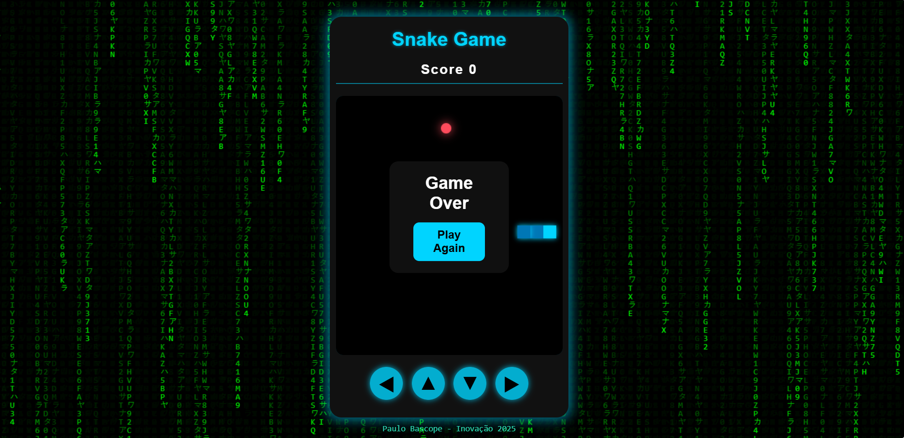

# 🎮 Snake Game com Visual Matrix

Projeto desenvolvido por **Paulo Bascope**, com o objetivo de criar uma versão moderna e estilizada do clássico jogo da cobrinha (Snake), utilizando apenas HTML, CSS e JavaScript.

 <!-- Substitua por uma imagem real do jogo se quiser -->

---

## ✨ Funcionalidades

- ✅ Jogo da cobrinha totalmente funcional
- 🌐 Design responsivo para desktop e mobile
- 🟢 Fundo animado estilo Matrix (Canvas)
- 🎯 Pontuação em tempo real
- 💥 Tela de Game Over com reinício
- 🎮 Controles de toque visuais (ideal para mobile)
- 🖋️ Marca d'água personalizada: **Paulo Bascope - Inovação 2025**

---

## 🚀 Tecnologias Utilizadas

- **HTML5**
- **CSS3** (incluindo responsividade)
- **JavaScript Puro**
- **Canvas API**

---

## 📱 Compatibilidade

- Navegadores modernos: Chrome, Firefox, Edge, Safari
- Dispositivos: Smartphones, tablets e desktops

---

## 📷 Captura de Tela

(Adicione aqui uma imagem mostrando o jogo em execução)  
```bash
Captura de tela 2025-05-12 034840.png
